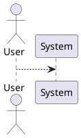
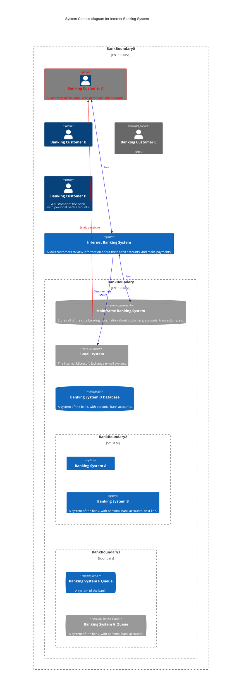
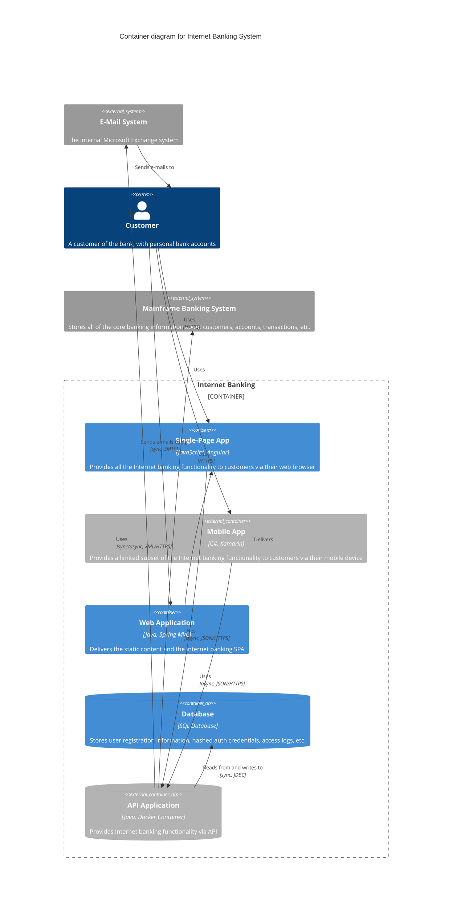

# Взаимодействие по АПИ

## Статьи
* Хабр. Создание собственного API на Python (FastAPI): Знакомство и первые функции:
https://habr.com/ru/companies/amvera/articles/826196/
* Тпрогер.Как создать API на Python без усилий на деплой 
https://tproger.ru/articles/kak-sozdat-api-na-python-bez-usilij-na-deploj
* Руководство по деплою (во все тяжкие)
https://itandcats.ru/fastapi-deployment-examples

## Хостинг
* Российское облако для хостинга
https://amvera.ru/
* 
# Команды
* Установить библиотеки (зависимости)
pip install -r requirements.txt

* Запуск сервера
uvicorn app.main:app --reload --host 0.0.0.0 --port 8000



```mermaid
C4Context
    title System Context diagram for Internet Banking System
    Workspace(b0, "boundary0") {

%%        !identifiers hierarchical
    
        model {
            u = person "User"
            ss = softwareSystem "Software System" {
                wa = container "Web Application"
                db = container "Database Schema" {
                    tags "Database"
                }
            }
    
            u -> ss "Uses"
            u -> ss.wa "Uses"
            ss.wa -> ss.db "Reads from and writes to"
        }
    
        views {
            systemContext ss "Diagram1" {
                include *
            }
    
            container ss "Diagram2" {
                include *
            }
    
            // styling...
        }
    
    }
```




В магазине доступны следующие товары:

| # | Название | Цена | Количество |
|---|----------|------|------------|
| 1 | Adidas | 13.0 ₽ | 2 |
| 2 | Reebok | 9.0 ₽ | 13 |
| 3 | Authlete | 15 ₽ | 1 |
| 4 | Nike shoes | 10.5 ₽ | 1 |
| 5 | Bekka shoes | 15.9 ₽ | 1 |
| 6 | Шмот | 130 ₽ | 1 500 000 |
| 7 | Marvel | 1900 ₽ | 16 |
| 8 | Colin's | 1400 ₽ | 1 |
| 9 | Преображение | 1490 ₽ | 200 |

Всего в магазине **9 наименований** товаров. Если вам что-то приглянулось или нужна дополнительная информация, дайте знать — помогу! 

Отличный вопрос! Раз вы уже увидели, как агент оркестрирует вызовы инструментов (пример выше — это как раз команды `get_products` и `get_current_time` с ответами), теперь разберём, как правильно организовать MCP-сервер в контексте **ALFAGEN Enterprise**.
---

## Архитектура MCP-сервера в ALFAGEN Enterprise

В общем виде организация выглядит так:

```
┌─────────────────────────────────────────────────┐
│            ALFAGEN Enterprise (хост)            │
│          Агент / MCP-Client (Orchestrator)      │
└───────────────┬─────────────────────────────────┘
                │ MCP-протокол (stdio / HTTP/SSE)
                ▼
┌─────────────────────────────────────────────────┐
│              MCP-сервер (tools)                 │
│  ┌────────────┐  ┌────────────┐  ┌───────────┐  │
│  │  Tool #1   │  │  Tool #2   │  │  Tool #N  │  │
│  │ get_products│  │get_current │  │  ...      │  │
│  │            │  │   _time    │  │           │  │
│  └────────────┘  └────────────┘  └───────────┘  │
│              └─ подключения к данным ─┐          │
└────────────────────────────────────────┬────────┘
                                         ▼
                              БД / API / Файлы
```

---

## Ключевые шаги организации

### 1. Определите границы инструментов

MCP-сервер — это **изолированный процесс**, который регистрирует набор tool-функций. Правило: один сервер = одна **предметная область**. Например:

- `catalog-server` — товары, цены, остатки (как `get_products`);
- `time-server` — системное время, утилиты (`get_current_time`);
- `integration-server` — вызовы внешних API (ERP, CRM).

Не стоит сваливать всё в один сервер — это усложняет обслуживание и переиспользование.

### 2. Стандартный контракт инструмента

Каждый tool на MCP-сервере должен объявляться по стандартной схеме:

```json
{
  \"name\": \"get_products\",
  \"description\": \"Возвращает перечень или список товаров из магазина\",
  \"inputSchema\": {
    \"type\": \"object\",
    \"properties\": { },
    \"required\": []
  }
}
```

Агент-оркестратор на стороне ALFAGEN Enterprise подхватывает эти описания и автоматически знает, когда и какой инструмент вызвать.

### 3. Типы транспорта (на выбор)

| Транспорт  | Когда использовать                                      |
|------------|---------------------------------------------------------|
| `stdio`    | Локальное развёртывание, единый контур, простая отладка |
| HTTP/SSE   | Распределённая среда, несколько хостов, микросервисы    |
| HTTP Stream (streamable) | Продвинутые сценарии, длительные операции      |

### 4. Пакетная регистрация и схема лицензирования

В ALFAGEN Enterprise планирование подключения MCP-серверов выполняется отдельной конфигурацией (как правило — через узел **«Интеграции / MCP»**). Там вы указываете:

- endpoint транспорта;
- список доступных tools;
- права доступа (какие агенты и сценарии могут вызывать tools);
- политики безопасности и аудит вызовов.

---

## Пример минимального каркаса MCP-сервера (иллюстрация)

```python
# catalog_server.py
from mcp.server.fastmcp import FastMCP

mcp = FastMCP(\"catalog-server\")

@mcp.tool()
def get_products() -> list[dict]:
    \"\"\"Возвращает перечень или список товаров из магазина\"\"\"
    return db.query(\"SELECT ...\")  # ваша логика

@mcp.tool()
def get_current_time() -> str:
    \"\"\"Возвращает текущую дату и время в формате ISO\"\"\"
    from datetime import datetime
    return datetime.now().isoformat()

if __name__ == \"__main__\":
    mcp.run(transport=\"stdio\")   # или \"http\"
```

---

## Практические рекомендации

1. **Сначала локально, потом в контур.** Начните с `stdio`-сервера, протестируйте оркестрацию (как вы уже делали), затем переводите на HTTP.
2. **Именуйте tools глаголами** (`get_`, `create_`, `update_`, `list_`), чтобы агент однозначно понимал назначение.
3. **Пишите понятные description** — они становятся «промптом» для агента при выборе инструмента.
4. **Держите инвентаризацию tools** — в ALFAGEN Enterprise есть реестр доступных вызовов, куда сервер публикует свои capabilities.
5. **Обеспечьте идемпотентность и обработку ошибок** на сервере: агент должен получать предсказуемые ответы, а не исключения в произвольном формате.

---

Если хотите, могу подробнее расписать **конкретный шаблон подключения MCP-сервера к контуру ALFAGEN Enterprise** (конфигурация, безопасность, аудит) или привести **пример репозитория с готовой структурой каталога** для MCP-сервера. Что из этого было бы полезнее всего?