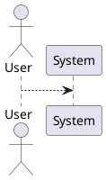
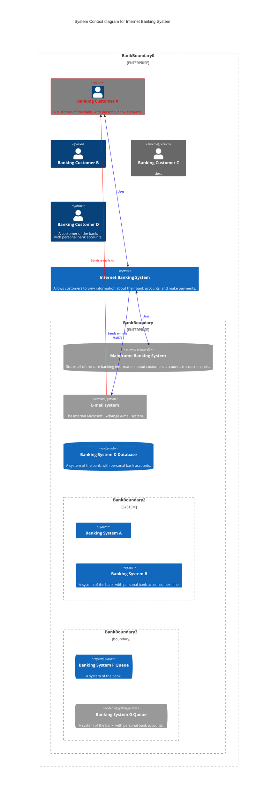
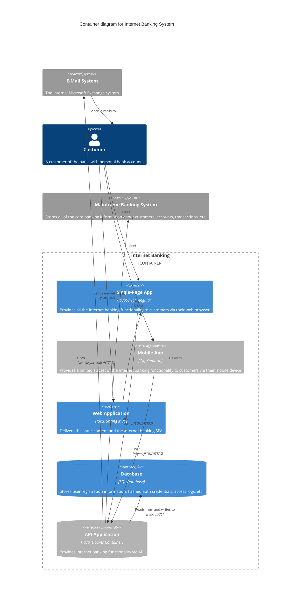

# Взаимодействие по АПИ

## Статьи
* Хабр. Создание собственного API на Python (FastAPI): Знакомство и первые функции:
https://habr.com/ru/companies/amvera/articles/826196/
* Тпрогер.Как создать API на Python без усилий на деплой 
https://tproger.ru/articles/kak-sozdat-api-na-python-bez-usilij-na-deploj
* Руководство по деплою (во все тяжкие)
https://itandcats.ru/fastapi-deployment-examples

## Хостинг
* Российское облако для хостинга
https://amvera.ru/
* 
# Команды
* Установить библиотеки (зависимости)
pip install -r requirements.txt

* Запуск сервера
uvicorn app.main:app --reload --host 0.0.0.0 --port 8000



```mermaid
C4Context
    title System Context diagram for Internet Banking System
    Workspace(b0, "boundary0") {

%%        !identifiers hierarchical
    
        model {
            u = person "User"
            ss = softwareSystem "Software System" {
                wa = container "Web Application"
                db = container "Database Schema" {
                    tags "Database"
                }
            }
    
            u -> ss "Uses"
            u -> ss.wa "Uses"
            ss.wa -> ss.db "Reads from and writes to"
        }
    
        views {
            systemContext ss "Diagram1" {
                include *
            }
    
            container ss "Diagram2" {
                include *
            }
    
            // styling...
        }
    
    }
```




В магазине доступны следующие товары:

| # | Название | Цена | Количество |
|---|----------|------|------------|
| 1 | Adidas | 13.0 ₽ | 2 |
| 2 | Reebok | 9.0 ₽ | 13 |
| 3 | Authlete | 15 ₽ | 1 |
| 4 | Nike shoes | 10.5 ₽ | 1 |
| 5 | Bekka shoes | 15.9 ₽ | 1 |
| 6 | Шмот | 130 ₽ | 1 500 000 |
| 7 | Marvel | 1900 ₽ | 16 |
| 8 | Colin's | 1400 ₽ | 1 |
| 9 | Преображение | 1490 ₽ | 200 |

Всего в магазине **9 наименований** товаров. Если вам что-то приглянулось или нужна дополнительная информация, дайте знать — помогу! 
